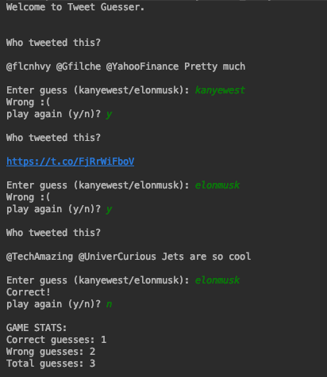

## Usage

To make code compile, create file in root directory called twitter4j.properties and add the 
following:

```bash
debug=true  
oauth.consumerKey=*******
oauth.consumerSecret=******
oauth.accessToken=********
oauth.accessTokenSecret=*********
```

Run main in GetTweets to play game (can use command line or an IDE).

## Example Run
